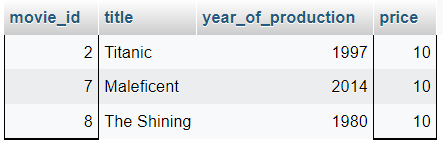

# TASK 5
## Subtask 1 
### Operatory, których się nauczyłam
- AND
- OR
- IN
- BETWEEN
- IS
- '>'
- '<'
- '='

### Zapytania, których się nauczyłam
- SELECT * FROM tabela WHERE warunek
- INSERT INTO tabela (kolumny) VALUES (wartości)
- UPDATE  tabela SET kolumna = wartość WHERE kolumna1 = wartosc1

## Subtask 3 Kilka zadań na rozgrzewkę

### 1. Wyświetl tabelę actors w kolejności alfabetycznej sortując po kolumnie surname. 

```sql
SELECT * FROM actors ORDER BY surname;
```


### 2. Wyświetl film, który powstał w 2019 roku.

```sql
SELECT * FROM movies WHERE year_of_production = 2019;
```


### 3. Wyświetl wszystkie filmy, które powstały między 1900, a 1999 rokiem.
```sql
SELECT * FROM movies WHERE year_of_production BETWEEN 1900 AND 1999;
```


### 4. Wyświetl JEDYNIE tytuł i cenę filmów, które kosztują poniżej 7$.

```sql
SELECT title, price FROM movies WHERE price < 7;
```


### 5. Użyj operatora logicznego AND, aby wyświetlić aktorów o actor_id pomiędzy 4-7 (4 i 7 powinny się wyświetlać). NIE UŻYWAJ operatora BETWEEN.

```sql
SELECT * FROM actors WHERE actor_id >= 4 AND actor_id <= 7;
```


### 6. Wyświetl klientów o id 2, 4, 6. Wykorzystaj do tego warunek logiczny. 

```sql
SELECT * FROM customers WHERE customer_id = 2 OR customer_id = 4 OR customer_id = 6;
```


### 7. Wyświetl klientów o id 1,3,5 wykorzystaj do tego operator IN. 

```sql
SELECT * FROM customers WHERE customer_id IN (1, 3, 5);
```


### 8. Wyświetl dane wszystkich osób z tabeli ‘actors’, których imię zaczyna się od ciągu “An”.

```sql
SELECT * FROM actors WHERE name LIKE 'An%';
```


### 9. Wyświetl dane klienta, który nie ma podanego adresu email.

```sql
SELECT * FROM customers WHERE email IS NULL;
```


### 10. Wyświetl wszystkie filmy, których cena wynosi powyżej 9$ oraz ich ID mieści się pomiędzy 2 i 8 movie_id.

```sql
SELECT * FROM movies WHERE price > 9 AND movie_id BETWEEN 2 AND 8;
```


