# Task 6

## Subtask 1

### 11. Popełniłam błąd, wpisując nazwisko Ani Miler – wpisałam Muler. Znajdź i zastosuj funkcję, która poprawi ten błąd.

```sql
UPDATE customers
SET surname = 'Miler'
WHERE surname = 'Muler'
```

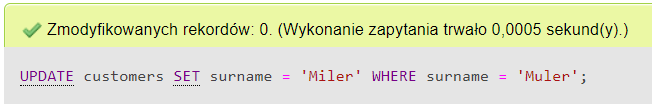

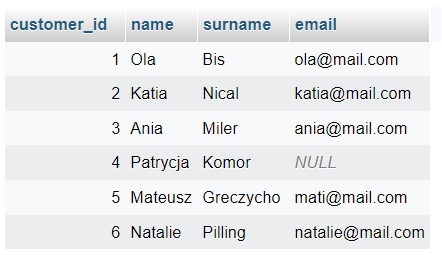

### 12. Pobrałam za dużo pieniędzy od klienta, który kupił w ostatnim czasie film o id 4. Korzystając z funkcji join, sprawdź, jak ma na imię klient i jakiego ma maila.

```sql
SELECT name, email FROM `sale`as s
JOIN customers as c ON c.customer_id = s.customer_id
WHERE movie_id = 4
```
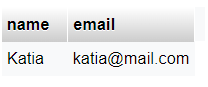

### 13. Na pewno zauważyłaś, że sprzedawca zapomniał wpisać emaila klientce o imieniu Patrycja. Uzupełnij ten brak, wpisując: pati@mail.com
```sql
UPDATE customers
SET email = 'pati@mail.com'
WHERE name = 'Patrycja' AND email is null
```

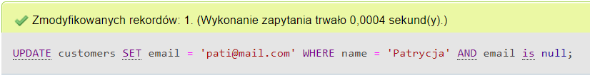

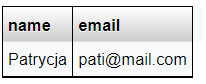

### 14. Dla każdego zakupu wyświetl, imię i nazwisko klienta, który dokonał zakupu oraz tytuł kupionego filmu. (wykorzystaj do tego funkcję inner join, zastanów się wcześniej, które tabele Ci się przydadzą do wykonania ćwiczenia).

```sql
SELECT sale_date, name, surname, title 
FROM sale 
INNER JOIN customers as c ON sale.customer_id = c.customer_id
INNER JOIN movies as m ON sale.movie_id = m.movie_id
```


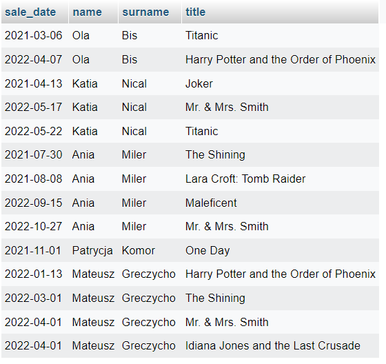

### 15. W celu anonimizacji danych, chcesz stworzyć pseudonimy swoich klientów. - Dodaj kolumnę o nazwie ‘pseudonym’ do tabeli customer,- Wypełnij kolumnę w taki sposób, aby pseudonim stworzył się z dwóch pierwszych liter imienia i ostatniej litery nazwiska. Np. Natalie Pilling → Nag

```sql
ALTER TABLE customers ADD COLUMN pseudonym char (3);
UPDATE customers SET pseudonym = CONCAT(LEFT(name, 2), RIGHT(surname, 1));
```

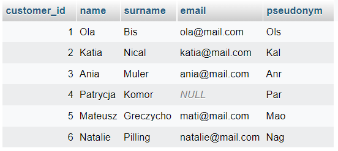

### 16. Wyświetl tytuły filmów, które zostały zakupione, wyświetl tabelę w taki sposób, aby tytuły się nie powtarzały.

```sql
SELECT DISTINCT title
FROM `movies` AS m
INNER JOIN sale AS s ON s.movie_id = m.movie_id
```

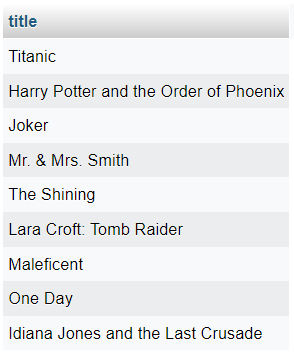

### 17. Wyświetl wspólną listę imion wszystkich aktorów i klientów, a wynik uporządkuj alfabetycznie. (Wykorzystaj do tego funkcji UNION)
```sql
SELECT name FROM actors
UNION
SELECT name FROM customers
ORDER BY name;
```

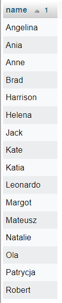

### 18. Polskę opanowała inflacja i nasz sklepik z filmami również dotknął ten problem. Podnieś cenę wszystkich filmów wyprodukowanych po 2000 roku o 2,5 $ (Pamiętaj, że dolar to domyślna jednostka - nie używaj jej nigdzie).
```sql
UPDATE movies SET price = price + 2.5 WHERE year_of_production > 2000;
```

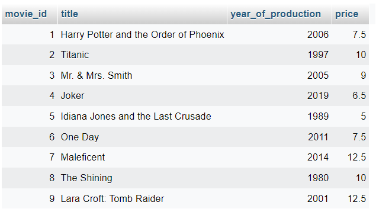

### 19. Wyświetl imię i nazwisko aktora o id 4 i tytuł filmu, w którym zagrał

```sql
SELECT name, surname, title FROM `actors`
INNER JOIN cast ON actors.actor_id = cast.actor_id
INNER JOIN movies ON cast.movie_id = movies.movie_id
WHERE actors.actor_id = 4
```

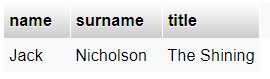

### 20. A gdzie nasza HONIA!? Dodaj do tabeli customers nową krotkę, gdzie customer_id = 7, name = Honia, surname = Stuczka-Kucharska, email = [honia@mail.com](mailto:honia@mail.com) oraz pseudonym = Hoa

```sql
INSERT INTO customers (customer_id, name, surname, email, pseudonym) VALUES (7, 'Honia', 'Stuczka-Kucharska', 'honia@mail.com', 'Hoa')
```

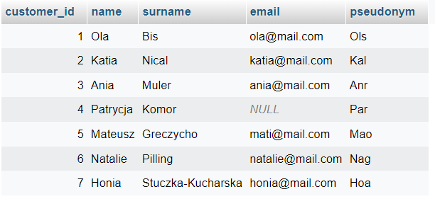

## Subtask 2 - Test

Po rozwiązaniu zestaw pytań ECRU na stronie http://getistqb.com/ zdobyłam 10/15 punktów.
Pewnie będę waracać do zagadnień zawartych w Sylabusie.
